<div align="center">

# 🌍 Real-Time Environmental Sentinel

**Dual-Core FreeRTOS Multi-Sensor Acquisition & IoT Reporting on ESP32**

[](https://github.com/ficrammanifur/Real-Time-Environmental-Sentinel)
[](https://cplusplus.com/)
[](https://www.espressif.com/)
[](https://www.arduino.cc/)
[](https://www.freertos.org/)
[](https://thingspeak.com/)
[](https://github.com)
[](LICENSE)

*Sistem monitoring lingkungan real-time dengan multi-sensor, FreeRTOS multi-task, dan cloud IoT integration*

**📍 Indonesia** | **🗓️ Updated January 27, 2026**

</div>

---

## 📑 Daftar Isi (Table of Contents)

- [✨ Features](#-features)
- [🧩 Komponen Utama](#-komponen-utama)
- [🏗️ Arsitektur Sistem](#-Arsitektur-Sistem)
- [🔄 Alur Kerja Sistem](#-alur-kerja-sistem)
- [📁 Struktur Project](#-struktur-project)
- [🚀 Quick Start](#-quick-start)
- [🔌 Pin Configuration](#-pin-configuration)
- [⚙️ Konfigurasi](#️-konfigurasi)
- [📊 Output & Monitoring](#-output--monitoring)
- [🔧 Troubleshooting](#-troubleshooting)

---

## System Overview

```mermaid
graph TB
    subgraph User["👤 User Interaction Layer"]
        U1["📱 ThingSpeak Web Dashboard"]
        U2["🔍 Mobile App View"]
        U3["📊 Real-time Charts"]
    end
    
    subgraph Cloud["☁️ Cloud Services"]
        TS["ThingSpeak API Server<br/>4 Data Fields"]
        DB["Cloud Database<br/>Time-Series Storage"]
        AUTH["API Authentication<br/>Channel + Key"]
    end
    
    subgraph Network["🌐 Network Layer"]
        WIFI["ESP32 WiFi Module<br/>802.11 b/g/n"]
        HTTP["HTTP Client<br/>RESTful API"]
    end
    
    subgraph ESP["⚙️ ESP32 System"]
        subgraph Core0["🔷 Core 0 - Sensor Processing"]
            S1["📡 MQ-135 ADC"]
            S2["🌡️ LM35 ADC"]
            S3["💨 DHT22 I2C"]
            S4["💡 LDR ADC"]
            PROCESS["🧠 Fusion & Averaging"]
            LED["🔴 LED Toggle"]
        end
        
        subgraph Core1["🔶 Core 1 - Cloud Upload"]
            CHECK["🌐 WiFi Check"]
            BUILD["🔗 URL Builder"]
            POST["📤 HTTP POST"]
        end
        
        subgraph RTOS["🔄 Real-Time OS"]
            SCHED["Task Scheduler"]
            Q["📦 Queue (5 items)"]
            M["🔐 Mutex"]
        end
    end
    
    subgraph HW["🔧 Hardware Sensors"]
        MQ135["MQ-135<br/>Gas Quality"]
        LM35["LM35<br/>Temperature"]
        DHT22["DHT22<br/>Temp + Humidity"]
        LDR["LDR<br/>Light Intensity"]
    end
    
    S1 --> PROCESS
    S2 --> PROCESS
    S3 --> PROCESS
    S4 --> PROCESS
    LED -.->|Toggle| PROCESS
    PROCESS --> Q
    
    Q --> CHECK
    CHECK --> BUILD
    BUILD --> POST
    
    MQ135 -.->|GPIO35| S1
    LM35 -.->|GPIO32| S2
    DHT22 -.->|GPIO27| S3
    LDR -.->|GPIO34| S4
    
    PROCESS -.->|Protected| M
    POST -.->|Protected| M
    
    SCHED --> Core0
    SCHED --> Core1
    
    POST --> HTTP
    HTTP --> WIFI
    WIFI --> AUTH
    AUTH --> TS
    TS --> DB
    
    DB --> U1
    DB --> U2
    DB --> U3
    
    style User fill:#e1f5fe
    style Cloud fill:#e8f5e9
    style Network fill:#fff9c4
    style ESP fill:#f5f5f5
    style Core0 fill:#fff3e0
    style Core1 fill:#f3e5f5
    style RTOS fill:#e3f2fd
    style HW fill:#ffebee
```

## ✨ Features

- **🔁 Multi-Sensor Real-Time Acquisition** - Simultaneous reading dari 4 sensor berbeda
- **🧠 Sensor Fusion** - Averaging suhu dari LM35 dan DHT22 untuk akurasi lebih tinggi
- **⚙️ Dual-Core FreeRTOS** - Core 0 untuk sensor, Core 1 untuk IoT (non-blocking)
- **🌐 WiFi Auto-Configuration** - Menggunakan WiFiManager untuk kemudahan setup
- **☁️ Cloud IoT Integration** - Real-time data push ke ThingSpeak cloud platform
- **💡 LED Indicator** - Visual feedback untuk sistem yang aktif (task alive)
- **📊 Multi-Field Data** - Temperature, Humidity, Gas, dan Light Intensity monitoring
- **🔒 Thread-Safe** - Mutex protection untuk akses Serial Monitor

---

## 🧩 Komponen Utama

| Komponen | Spesifikasi | Fungsi |
|----------|-------------|--------|
| **ESP32 DevKitC** | Dual-Core, 240MHz | Mikrokontroler utama |
| **MQ-135** | Gas Sensor (ADC) | Deteksi kualitas udara |
| **LM35** | Temperature Sensor | Pembacaan suhu analog (°C) |
| **DHT22** | Temp & Humidity | Sensor kombinasi suhu & kelembaban |
| **LDR** | Light Sensor | Pengukur intensitas cahaya |
| **LED** | GPIO33 | Indikator task alive |
| **ThingSpeak** | Cloud Platform | Dashboard IoT monitoring |

---

## Arsitektur Sistem

### Diagram Blok Sistem


### Flowchart - Boot & Initialization

```mermaid
flowchart TD
    START([🚀 ESP32 Boot]) --> INIT["⚙️ Initialize Hardware<br/>GPIO, ADC, I2C"]
    INIT --> FIRST{First Boot?}
    FIRST -->|Yes| PORTAL["📡 Start WiFiManager<br/>Portal 192.168.4.1"]
    FIRST -->|No| CONNECT["🌐 Connect WiFi<br/>Auto"]
    PORTAL --> STORE["💾 Store WiFi Creds"]
    STORE --> CONNECT
    CONNECT --> WIFI_OK{WiFi OK?}
    WIFI_OK -->|No| RETRY["⏰ Retry Loop"]
    RETRY --> CONNECT
    WIFI_OK -->|Yes| CREATE["📦 Create Queue & Mutex"]
    CREATE --> TASK0["🔷 Create Core 0 Task<br/>sensorTask"]
    TASK0 --> TASK1["🔶 Create Core 1 Task<br/>iotTask"]
    TASK1 --> READY["✅ System Ready<br/>Idle"]
    READY --> END([🔄 FreeRTOS Loop])
```

### Flowchart - Main Operations

```mermaid
flowchart LR
    subgraph SENSOR["🔷 SENSOR TASK - Every 2s"]
        S1["📡 Read MQ-135<br/>20x avg"] --> S2["🌡️ Read LM35<br/>Convert °C"]
        S2 --> S3["💨 Read DHT22"]
        S3 --> S4["💡 Read LDR<br/>Map 0-100%"]
        S4 --> S5["🧠 Fusion Temp<br/>Avg LM35+DHT"]
        S5 --> S6["🔴 Toggle LED<br/>Task Alive"]
        S6 --> S7["📤 Queue Send<br/>SensorData"]
        S7 --> S8["😴 Sleep 2000ms"]
    end
    
    subgraph IOT["🔶 IOT TASK - Every 15s"]
        I1["📦 Queue Receive"] --> I2{WiFi<br/>OK?}
        I2 -->|No| I3["⏭️ Skip Upload"]
        I2 -->|Yes| I4["🌐 HTTP POST<br/>Build URL"]
        I4 --> I5["📡 Send Data<br/>4 Fields"]
        I5 --> I6["✅ Check Response"]
        I6 --> I3
        I3 --> I7["😴 Sleep 15000ms"]
    end
    
    SENSOR --> IOT
    IOT --> SENSOR
    
    style SENSOR fill:#fff3e0
    style IOT fill:#f3e5f5
```

### Sequence Diagram - Inter-Task Communication


### System Architecture Diagram


---

## 🔄 Alur Kerja Sistem

### 1. Data Flow Diagram

```mermaid
graph TB
    subgraph INPUT["📥 Sensor Input"]
        RAW["Raw Sensor Data"]
    end
    
    subgraph PROCESSING["⚙️ Data Processing"]
        ADC["ADC Conversion"]
        AVG["Averaging (20 samples)"]
        FUSION["Temperature Fusion"]
    end
    
    subgraph COMMUNICATION["📡 Communication"]
        QUEUE["Queue Send"]
        CORE1["Core 1 Receive"]
        WIFI{WiFi OK?}
    end
    
    subgraph UPLOAD["☁️ Cloud Upload"]
        BUILD["Build HTTP URL"]
        POST["HTTP POST"]
        CLOUD["ThingSpeak Cloud"]
    end
    
    subgraph TIMING["⏰ Timing Control"]
        DELAY["Delay 15s"]
    end
    
    RAW --> ADC
    ADC --> AVG
    AVG --> FUSION
    FUSION --> QUEUE
    QUEUE --> CORE1
    CORE1 --> WIFI
    WIFI -->|Yes| BUILD
    WIFI -->|No| DELAY
    BUILD --> POST
    POST --> CLOUD
    CLOUD --> DELAY
    DELAY --> CORE1
    
    style INPUT fill:#e8f5e9
    style PROCESSING fill:#fff3e0
    style COMMUNICATION fill:#e1f5ff
    style UPLOAD fill:#f3e5f5
    style TIMING fill:#ffebee
```

### 2. Core 0 - Sensor Task (Every 2 seconds)

```mermaid
flowchart TB
    subgraph CORE0["🔷 CORE 0 - SENSOR TASK"]
        START(["Start"]) --> LOCK["🔒 Lock Mutex"]
        LOCK --> SENSORS["📡 Read All Sensors"]
        
        SENSORS --> MQ["MQ-135<br/>Gas Level"]
        SENSORS --> LM["LM35<br/>Temperature"]
        SENSORS --> DHT["DHT22<br/>Temp & Humidity"]
        SENSORS --> LDR["LDR<br/>Light Level"]
        
        MQ --> AVG["📊 Average Values"]
        LM --> AVG
        DHT --> AVG
        LDR --> AVG
        
        AVG --> FUSION["🧠 Temperature Fusion"]
        FUSION --> LED["🔴 Toggle LED"]
        LED --> PACK["📦 Prepare SensorData"]
        PACK --> SEND["📤 Queue Send"]
        SEND --> UNLOCK["🔓 Unlock Mutex"]
        UNLOCK --> DELAY["😴 Delay 2000ms"]
        DELAY --> START
    end
```

### 3. Core 1 - IoT Task (Every 15 seconds)

```mermaid
flowchart TB
    subgraph CORE1["🔶 CORE 1 - IOT TASK"]
        START(["Start"]) --> RECEIVE["📥 Queue Receive"]
        RECEIVE --> DATAOK{"Data Valid?"}
        
        DATAOK -->|No| SKIP["⏭️ Skip Upload"]
        DATAOK -->|Yes| WIFI["🌐 Check WiFi"]
        
        WIFI --> WIFIOK{"WiFi OK?"}
        WIFIOK -->|No| FAIL["❌ Log Error"]
        WIFIOK -->|Yes| UPLOAD["☁️ Upload Process"]
        
        UPLOAD --> API["🔑 Load API Key"]
        API --> URL["🔗 Build HTTP URL"]
        URL --> HTTP["📤 HTTP POST"]
        HTTP --> RESP{"Response OK?"}
        
        RESP -->|Yes| SUCCESS["✅ Log Success"]
        RESP -->|No| FAIL
        
        SUCCESS --> DELAY
        FAIL --> DELAY
        SKIP --> DELAY
        
        DELAY["😴 Delay 15000ms"] --> START
    end
```

### 4. State Machine Diagram

```mermaid
flowchart TB
    subgraph STATES["🔄 System States"]
        POWER(["Power On"]) --> INIT["⚙️ Initialize Hardware<br/>GPIO, ADC, I2C"]
        INIT --> WIFI_CFG{"WiFi<br/>Saved?"}
        
        WIFI_CFG -->|No| AP["📡 Start AP Mode"]
        AP --> CONFIG["🔧 Configure WiFi"]
        CONFIG --> WIFI["🌐 Connect WiFi"]
        
        WIFI_CFG -->|Yes| WIFI
        
        WIFI --> READY["✅ System Ready"]
        READY --> RUN["🏃 System Running"]
        
        RUN --> ACTION{"Upload<br/>Cycle?"}
        ACTION -->|Yes| UPLOAD["☁️ Upload Data"]
        ACTION -->|No| SKIP["⏭️ Skip Upload"]
        
        UPLOAD --> RUN
        SKIP --> RUN
    end
    
    style STATES fill:#f5f5f5
    style POWER fill:#e8f5e9
    style INIT fill:#e3f2fd
    style WIFI fill:#fff3e0
    style READY fill:#e8f5e9
    style RUN fill:#f3e5f5
```

---

## 📁 Struktur Project

```
Real-Time-Environmental-Sentinel/
│
├── main.ino                     # 📝 Code Utama (ESP32 Sketch)
│
├── test/                        # 🧪 Test & Debugging Sketches
│   ├── test_mq135.ino          # Testing MQ-135 Gas Sensor
│   ├── test_lm35.ino           # Testing LM35 Temperature
│   ├── test_dht22.ino          # Testing DHT22 Sensor
│   ├── test_ldr.ino            # Testing LDR Light Sensor
│   ├── test_led_alive.ino      # Testing LED Blinking
│   └── test_wifi.ino           # Testing WiFi Connection
│
├── diagrams/                    # 📊 Dokumentasi Visual
│   └── block_diagram.png       # Diagram blok sistem
│
├── media/                       # 🎥 Demo & Documentation
│   └── demo_video.mp4          # Video demo sistem
│
├── README.md                    # 📖 Dokumentasi (file ini)
└── LICENSE                      # 📄 MIT License
```

---

## 🚀 Quick Start

### 1. Persiapan Hardware
- Siapkan ESP32 DevKitC
- Sambungkan semua sensor sesuai pin configuration (lihat di bawah)
- Pastikan semua kabel terhubung dengan baik

### 2. Setup Arduino IDE
```bash
# 1. Download & install Arduino IDE
# 2. Add ESP32 board via Board Manager
#    URL: https://raw.githubusercontent.com/espressif/arduino-esp32/gh-pages/package_esp32_index.json

# 3. Install required libraries:
#    - WiFiManager
#    - DHT Sensor Library
#    - (HTTPClient, WiFi sudah built-in Arduino)
```

### 3. Upload Code
```bash
# 1. Buka main.ino di Arduino IDE
# 2. Select Board: ESP32 Dev Module
# 3. Select Serial Port: COM3 (atau sesuai device Anda)
# 4. Set Upload Speed: 115200
# 5. Click Upload (atau Ctrl+U)
```

### 4. Konfigurasi WiFi & API Key
```bash
# Saat ESP32 menyala (first boot):
# 1. Cari WiFi network: "ESP32-EnvSentinel"
# 2. Connect ke network tersebut
# 3. Buka browser: http://192.168.4.1
# 4. Setup WiFi SSID dan Password
# 5. ESP32 akan restart & connect

# Setup ThingSpeak:
# 1. Register di https://thingspeak.com
# 2. Create new Channel
# 3. Copy API Key Anda
# 4. Edit main.ino: String apiKey = "ISI_API_KEY_KAMU";
# 5. Upload kode lagi
```

### 5. Monitoring
```bash
# Buka Serial Monitor (Ctrl+Shift+M)
# Baud Rate: 115200
# Lihat output sensor real-time
# Buka ThingSpeak Dashboard untuk cloud monitoring
```

---

## 🔌 Pin Configuration

### GPIO Mapping & Hardware Assignment

| No. | Sensor | GPIO | ADC | Function | Voltage | Status |
|-----|--------|------|-----|----------|---------|--------|
| 1 | **MQ-135** | 35 | ADC1 | Gas Quality | 0-3.3V | ✅ Input |
| 2 | **LM35** | 32 | ADC1 | Temperature | 0-3.3V | ✅ Input |
| 3 | **LDR** | 34 | ADC1 | Light Level | 0-3.3V | ✅ Input |
| 4 | **DHT22** | 27 | - | Temp+Humidity | 3.3V | ✅ I2C |
| 5 | **LED** | 33 | - | Status Indicator | 3.3V | ✅ Output |
| 6 | **GND** | GND | - | Common Ground | 0V | - |
| 7 | **3V3** | 3V3 | - | Power Supply | 3.3V | - |

### Pin Connection Diagram

```mermaid
graph LR
    subgraph ESP32["ESP32 DevKitC"]
        GND["🔌 GND (Commons)"]
        PWR["⚡ 3V3 (Power)"]
        GPIO35["📍 GPIO35 ADC1"]
        GPIO32["📍 GPIO32 ADC1"]
        GPIO34["📍 GPIO34 ADC1"]
        GPIO27["📍 GPIO27 Digital"]
        GPIO33["📍 GPIO33 Output"]
    end
    
    subgraph Sensors["🔧 External Sensors"]
        MQ["MQ-135 Gas Sensor<br/>Output: AO pin"]
        LM["LM35 Temp Sensor<br/>Output: OUT pin"]
        LDR["LDR Light Sensor<br/>With 2kΩ Resistor"]
        DHT["DHT22 Combo<br/>Temp + Humidity"]
        LED["LED Indicator<br/>Red, 2-3mA"]
    end
    
    GPIO35 -->|ADC Read| MQ
    GPIO32 -->|ADC Read| LM
    GPIO34 -->|ADC Read| LDR
    GPIO27 -->|1-Wire| DHT
    GPIO33 -->|Digital Out| LED
    
    MQ --> GND
    LM --> GND
    LDR --> GND
    DHT --> GND
    LED --> GND
    
    PWR --> MQ
    PWR --> LM
    PWR --> LDR
    PWR --> DHT
    
    style ESP32 fill:#e3f2fd
    style Sensors fill:#fff3e0
    style GND fill:#ffebee
    style PWR fill:#e8f5e9
```

### Physical Wiring Schematic

```mermaid
graph TB
    subgraph ESP32_Pins["ESP32 Pinout"]
        P1["🔴 3V3"]
        P2["⚫ GND"]
        P3["📍 GPIO35"]
        P4["📍 GPIO32"]
        P5["📍 GPIO34"]
        P6["📍 GPIO27"]
        P7["📍 GPIO33"]
    end
    
    subgraph Connections["🔧 Connections"]
        M1["MQ-135<br/>GND"]
        M2["MQ-135<br/>VCC"]
        M3["MQ-135<br/>AO"]
        
        L1["LM35<br/>GND"]
        L2["LM35<br/>VCC"]
        L3["LM35<br/>OUT"]
        
        D1["LDR<br/>Top"]
        D2["LDR<br/>Bottom"]
        D3["2kΩ Resistor<br/>to GND"]
        
        T1["DHT22<br/>GND"]
        T2["DHT22<br/>VCC"]
        T3["DHT22<br/>DATA"]
        
        E1["LED+<br/>Anode"]
        E2["LED-<br/>Cathode"]
    end
    
    P1 -->|Power| M2
    P1 -->|Power| L2
    P1 -->|Power| T2
    
    P2 -->|Common| M1
    P2 -->|Common| L1
    P2 -->|Common| D2
    P2 -->|Common| D3
    P2 -->|Common| T1
    P2 -->|Common| E2
    
    P3 -->|ADC| M3
    P4 -->|ADC| L3
    P5 -->|ADC| D1
    P6 -->|Digital| T3
    P7 -->|GPIO| E1
    
    style P1 fill:#ffeb3b
    style P2 fill:#000000,color:#fff
    style P3 fill:#4fc3f7
    style P4 fill:#4fc3f7
    style P5 fill:#4fc3f7
    style P6 fill:#81c784
    style P7 fill:#f44336,color:#fff
```

### ADC Channel Distribution

```mermaid
graph LR
    ADC["🔷 ADC1 Peripheral<br/>12-bit SAR ADC<br/>Read: 0-4095"]
    
    subgraph Channels["Active Channels"]
        C1["CH6<br/>GPIO34<br/>LDR"]
        C2["CH5<br/>GPIO35<br/>MQ-135"]
        C3["CH4<br/>GPIO32<br/>LM35"]
    end
    
    subgraph Config["Sampling Config"]
        SPEED["⚡ Sampling Speed<br/>~100 kHz"]
        BITS["📊 Resolution<br/>12-bit"]
        ATTN["🔊 Attenuation<br/>11dB (0-3.3V)"]
    end
    
    ADC --> C1
    ADC --> C2
    ADC --> C3
    ADC --> SPEED
    ADC --> BITS
    ADC --> ATTN
    
    style ADC fill:#e1f5fe
    style Channels fill:#fff3e0
    style Config fill:#f3e5f5
```

---

## ⚙️ Konfigurasi

### API Key Configuration (main.ino)
```cpp
// Line 10: Setup ThingSpeak API Key
String apiKey = "ISI_API_KEY_KAMU";

// Line 14: DHT Configuration
#define DHTTYPE DHT22

// Line 39-40: WiFiManager Config
WiFiManager wm;
wm.setConfigPortalTimeout(180);  // 3 menit untuk setup WiFi
```

### Sensor Parameters
```cpp
// ADC Reading Averaging
int readADCAvg(int pin) {
  // Membaca 20x untuk smooth reading
  for (int i = 0; i < 20; i++) {
    sum += analogRead(pin);
    delay(2);
  }
  return sum / 20;
}

// LDR Mapping (sensor-dependent)
data.light = map(data.light, 0, 500, 0, 100);  // Adjust 500 sesuai sensor
```

### FreeRTOS Task Configuration

```mermaid
graph TB
    subgraph Setup["📋 Task Configuration"]
        T1["🔷 Sensor Task<br/>Core: 0<br/>Priority: 2<br/>Stack: 4096B"]
        T2["🔶 IoT Task<br/>Core: 1<br/>Priority: 1<br/>Stack: 4096B"]
        Q["📦 Queue<br/>Size: 5 items<br/>Item size: 20B"]
        M["🔐 Mutex<br/>Serial I/O<br/>Protection"]
    end
    
    subgraph Runtime["🔄 Task Runtime"]
        S["Core 0 Running<br/>Sensor Task<br/>2s cycle"]
        I["Core 1 Running<br/>IoT Task<br/>15s cycle"]
        COMM["Queue & Mutex<br/>Communication"]
    end
    
    Setup --> Runtime
    T1 --> S
    T2 --> I
    Q --> COMM
    M --> COMM
    S -.->|send via| COMM
    I -.->|receive via| COMM
    
    style T1 fill:#fff3e0
    style T2 fill:#f3e5f5
    style Q fill:#e3f2fd
    style M fill:#ffccbc
```

### Task Scheduling Timeline

```mermaid
timeline
    title Real-Time Task Scheduling - 30 Second Timeline
    
    section Core 0 - Sensor (2s cycle)
        0s: Start Task 🔷 : Read Sensors
        0-2s: : Processing
        2s: Queue Send ✅ : Toggle LED
        2-4s: Delay
        4s: Start Task 🔷 : Read Sensors
        4-6s: : Processing
        6s: Queue Send ✅ : Toggle LED
        6-8s: Delay
        8s: Start Task 🔷 : Read Sensors
        8-10s: : Processing
        10s: Queue Send ✅ : Toggle LED
        10-12s: Delay
        12s: Start Task 🔷 : Read Sensors
        12-14s: : Processing
        14s: Queue Send ✅ : Toggle LED
        14-16s: Delay
        16s: Start Task 🔷 : Read Sensors
        16-18s: : Processing
        18s: Queue Send ✅ : Toggle LED
        18-20s: Delay
        20s: Start Task 🔷 : Read Sensors
        20-22s: : Processing
        22s: Queue Send ✅ : Toggle LED
        22-24s: Delay
        24s: Start Task 🔷 : Read Sensors
        24-26s: : Processing
        26s: Queue Send ✅ : Toggle LED
        26-28s: Delay
        28s: Start Task 🔷 : Read Sensors
        28-30s: : Processing
        
    section Core 1 - IoT (15s cycle)
        0s: Waiting... ⏳
        2s: Queue Receive 📦 : Get Sensor Data
        2-5s: : Processing
        5s: HTTP POST 📡 : To ThingSpeak
        5-15s: Delay & Waiting
        15s: Queue Receive 📦 : Get Sensor Data
        15-18s: : Processing
        18s: HTTP POST 📡 : To ThingSpeak
        18-30s: Delay & Waiting
```

### Memory Layout Diagram

```mermaid
graph LR
    subgraph Memory["💾 ESP32 Memory Map (320KB SRAM)"]
        HEAP["🔹 Heap<br/>~200KB<br/>Available"]
        
        subgraph Tasks["📌 Task Stacks"]
            S["Sensor<br/>4KB"]
            I["IoT<br/>4KB"]
        end
        
        subgraph Data["📊 Data Structures"]
            Q["Queue Buffer<br/>~100B"]
            M["Mutex<br/>~50B"]
            ST["Sensor Struct<br/>~20B"]
        end
        
        CORE["🔧 Core OS<br/>~50KB"]
        LIB["📚 Libraries<br/>~30KB"]
    end
    
    HEAP -->|1%| Tasks
    HEAP -->|1%| Data
    HEAP -->|68%| Available["Available<br/>~136KB"]
    
    style HEAP fill:#fff9c4
    style S fill:#fff3e0
    style I fill:#f3e5f5
    style Q fill:#e3f2fd
    style M fill:#ffccbc
    style CORE fill:#c8e6c9
    style Available fill:#c5cae9
```

### Software Architecture Stack

```mermaid
graph TB
    subgraph APP["🎯 Application Layer"]
        MAIN["main.ino<br/>Setup & Loop"]
        SENSOR_MGR["📊 Sensor Manager<br/>Read & Process"]
        IOT_MGR["☁️ IoT Manager<br/>WiFi & ThingSpeak"]
        UI["🖨️ Serial Monitor<br/>Debug Output"]
    end
    
    subgraph RTOS["⚙️ FreeRTOS Real-Time OS"]
        TASK_MGR["Task Manager<br/>Scheduler"]
        QUEUE["📦 Queue Management<br/>IPC"]
        SYNC["🔐 Synchronization<br/>Mutex, Semaphore"]
        TIMER["⏱️ Timer Management<br/>Task Delays"]
    end
    
    subgraph HAL["🔧 Hardware Abstraction Layer"]
        ADC_DRV["ADC Driver<br/>analogRead"]
        GPIO_DRV["GPIO Driver<br/>digitalWrite"]
        I2C_DRV["I2C Driver<br/>Wire Library"]
        WIFI_DRV["WiFi Driver<br/>WiFi Library"]
    end
    
    subgraph HW["⚙️ Hardware"]
        ADC["🔹 ADC Peripheral"]
        GPIO["🔹 GPIO Controller"]
        I2C["🔹 I2C Interface"]
        RADIO["🔹 WiFi Radio"]
    end
    
    MAIN --> SENSOR_MGR
    MAIN --> IOT_MGR
    SENSOR_MGR --> UI
    IOT_MGR --> UI
    
    SENSOR_MGR --> TASK_MGR
    IOT_MGR --> TASK_MGR
    
    TASK_MGR --> QUEUE
    QUEUE --> SYNC
    TASK_MGR --> TIMER
    
    SENSOR_MGR --> ADC_DRV
    SENSOR_MGR --> I2C_DRV
    IOT_MGR --> GPIO_DRV
    IOT_MGR --> WIFI_DRV
    
    ADC_DRV --> ADC
    GPIO_DRV --> GPIO
    I2C_DRV --> I2C
    WIFI_DRV --> RADIO
    
    style APP fill:#fff9c4
    style RTOS fill:#e3f2fd
    style HAL fill:#fff3e0
    style HW fill:#ffebee
```

```cpp
// Task Configuration Example
#define SENSOR_TASK_PRIORITY   2
#define IOT_TASK_PRIORITY      1
#define SENSOR_STACK_SIZE      4096
#define IOT_STACK_SIZE         4096
#define QUEUE_LENGTH           5
#define QUEUE_ITEM_SIZE        sizeof(SensorData)

// Queue & Mutex Declarations
QueueHandle_t dataQueue;
SemaphoreHandle_t serialMutex;

// Task Functions Prototypes
void sensorTask(void *pvParameters);
void iotTask(void *pvParameters);

// Initialization in setup()
dataQueue = xQueueCreate(QUEUE_LENGTH, QUEUE_ITEM_SIZE);
serialMutex = xSemaphoreCreateMutex();

xTaskCreatePinnedToCore(
  sensorTask,         // Task function
  "SensorTask",       // Name
  SENSOR_STACK_SIZE,  // Stack size
  NULL,               // Parameter
  SENSOR_TASK_PRIORITY,  // Priority
  NULL,               // Task handle
  0                   // Core 0
);

xTaskCreatePinnedToCore(
  iotTask,            // Task function
  "IoTTask",          // Name
  IOT_STACK_SIZE,     // Stack size
  NULL,               // Parameter
  IOT_TASK_PRIORITY,  // Priority
  NULL,               // Task handle
  1                   // Core 1
);
```

---

## 📊 Output & Monitoring

### Serial Monitor Output (Setiap 2 detik)
```
=== SENSOR DATA ===
Temp: 28.50 C
Humidity: 65.30 %
Gas ADC: 1250
Light: 45 %
===================
```

### ThingSpeak Cloud Fields
```
Field 1: Temperature (°C)      → range: -40 to +125
Field 2: Humidity (%)          → range: 0 to 100
Field 3: Gas ADC               → range: 0 to 4095
Field 4: Light Intensity (%)   → range: 0 to 100

Update Interval: 15 detik (ThingSpeak minimum)
```

### Visual Indicators
- **LED (GPIO33)**: Berkedip setiap 2 detik → sensor task aktif
- **Serial Monitor**: Data real-time untuk debugging
- **ThingSpeak Dashboard**: Visualisasi data cloud

---

## 🔧 Troubleshooting

### Diagnostic Tree

```mermaid
graph TD
    START["🔍 Problem Detected"] --> TYPE{Issue Type?}
    
    TYPE -->|Hardware| HW["❌ Hardware Issue"]
    TYPE -->|WiFi| WIFI["❌ WiFi Issue"]
    TYPE -->|Sensor| SENSOR["❌ Sensor Issue"]
    TYPE -->|Cloud| CLOUD["❌ Cloud Issue"]
    TYPE -->|Serial| SERIAL["❌ Serial Issue"]
    
    HW --> HW1["ESP32 tidak terdeteksi"]
    HW1 --> HW1S["✅ Install CH340 driver<br/>✅ Cek USB cable<br/>✅ Try port lain"]
    
    HW --> HW2["LED tidak berkedip"]
    HW2 --> HW2S["✅ Check GPIO33 connection<br/>✅ Verify LED polarity<br/>✅ Test dengan digitalWrite"]
    
    WIFI --> WIFI1["WiFi tidak connect"]
    WIFI1 --> WIFI1S["✅ Check WiFi tersedia<br/>✅ Open 192.168.4.1<br/>✅ Press RESET button"]
    
    SENSOR --> SENSOR1["Sensor membaca 0/aneh"]
    SENSOR1 --> SENSOR1S["✅ Verify pin connections<br/>✅ Upload test sketch<br/>✅ Check ADC channel"]
    
    CLOUD --> CLOUD1["ThingSpeak no upload"]
    CLOUD1 --> CLOUD1S["✅ Verify API Key<br/>✅ Check WiFi status<br/>✅ Check internet"]
    
    SERIAL --> SERIAL1["No Serial output"]
    SERIAL1 --> SERIAL1S["✅ Baud rate 115200<br/>✅ Check USB connection<br/>✅ Unplug/plug"]
    
    HW1S --> END["✅ Issue Resolved"]
    HW2S --> END
    WIFI1S --> END
    SENSOR1S --> END
    CLOUD1S --> END
    SERIAL1S --> END
    
    style START fill:#ffcdd2
    style TYPE fill:#ffe0b2
    style HW fill:#ffccbc
    style WIFI fill:#bbdefb
    style SENSOR fill:#fff9c4
    style CLOUD fill:#c8e6c9
    style SERIAL fill:#d1c4e9
    style END fill:#a5d6a7
```

### Common Issues & Solutions

```mermaid
graph LR
    subgraph Detection["🔍 Detection"]
        D1["❌ ESP32 not found<br/>in IDE"]
        D2["❌ No Serial output"]
        D3["❌ LED not blinking"]
        D4["❌ Sensor value = 0"]
    end
    
    subgraph Connectivity["🌐 Connectivity"]
        C1["❌ WiFi won't connect"]
        C2["❌ Portal not opening<br/>192.168.4.1"]
        C3["❌ Internet disconnects"]
    end
    
    subgraph Cloud["☁️ Cloud Integration"]
        CL1["❌ ThingSpeak no data"]
        CL2["❌ HTTP errors"]
        CL3["❌ API key invalid"]
    end
    
    subgraph Solutions["✅ Solutions"]
        S1["Install CH340 driver"]
        S2["Check baud 115200"]
        S3["Verify GPIO33"]
        S4["Test individual sensor"]
        S5["Check WiFi available"]
        S6["Power cycle ESP32"]
        S7["Verify API key"]
        S8["Check WiFi status"]
        S9["Check internet"]
    end
    
    D1 --> S1
    D2 --> S2
    D3 --> S3
    D4 --> S4
    
    C1 --> S5
    C2 --> S6
    C3 --> S9
    
    CL1 --> S7
    CL2 --> S8
    CL3 --> S7
    
    style Detection fill:#ffebee
    style Connectivity fill:#e3f2fd
    style Cloud fill:#e8f5e9
    style Solutions fill:#f3e5f5
```

---

## 📊 Performance & Specifications

### Timing Analysis & Execution Timeline

```mermaid
graph LR
    subgraph SensorPhase["🔷 Sensor Task Timing (2s cycle)"]
        S1["Read MQ135<br/>20ms"] --> S2["Read LM35<br/>10ms"]
        S2 --> S3["Read DHT22<br/>30ms"]
        S3 --> S4["Read LDR<br/>10ms"]
        S4 --> S5["Process Data<br/>10ms"]
        S5 --> S6["Queue Send<br/>1ms"]
    end
    
    subgraph Total["⏱️ Total"]
        T["~81ms Active<br/>~1919ms Sleep<br/>Total: 2000ms"]
    end
    
    SensorPhase --> Total
    
    style SensorPhase fill:#fff3e0
    style Total fill:#ffcc80
```

### Task Execution Performance

```mermaid
xychart-beta
    title Task Cycle Times (Microseconds)
    x-axis [MQ135, LM35, DHT22, LDR, Process, Queue, Total]
    y-axis "Time (μs)" 0 --> 100000
    line [20000, 10000, 30000, 10000, 10000, 1000, 81000]
```

### Memory Distribution

```mermaid
pie title ESP32 SRAM Usage (320KB Total)
    "Sensor Task Stack (4KB)" : 4
    "IoT Task Stack (4KB)" : 4
    "Queue Buffer (100B)" : 0.1
    "Mutex & Sync (50B)" : 0.05
    "Core RTOS (50KB)" : 50
    "Libraries (30KB)" : 30
    "Available Heap (200KB)" : 200
    "Other (1.8KB)" : 1.8
```

### Power Consumption Profile

```mermaid
xychart-beta
    title Power Consumption Cycle
    x-axis [Idle, Sensor<br/>Active, WiFi<br/>Idle, HTTP<br/>POST, Complete<br/>Cycle]
    y-axis "Current (mA)" 0 --> 250
    line [50, 120, 100, 180, 85]
    
    note Power consumption varies with WiFi signal strength
```

### Performance Characteristics Table

| Metric | Value | Details |
|--------|-------|---------|
| **Sensor Reading Time** | ~200ms | 20x averaging per sensor |
| **Queue Operation** | <1ms | Lock-free ring buffer |
| **HTTP POST** | 2-3s | Depends on WiFi signal |
| **WiFi Connect** | 1-5s | Auto-reconnect enabled |
| **Total Cycle** | 15s | ThingSpeak API minimum |
| **ESP32 CPU** | 240MHz | Dual-core @1.2V |
| **RAM Usage** | ~8KB | Tasks + Queues |
| **Flash Used** | ~300KB | Code + Libraries |
| **Boot Time** | 2-3s | WiFi init included |
| **Idle Current** | ~50mA | No WiFi activity |
| **Active Current** | 100-200mA | Sensor + WiFi |
| **Average Current** | 80-100mA | Over 15s cycle |
| **Throughput** | 4 Fields/15s | ThingSpeak fields |
| **Latency** | <500ms | Sensor to Queue |
| **Update Rate** | 0.27Hz | 1 update per 15s |

### System Benchmarks

```mermaid
graph TB
    subgraph Response["📊 Response Times"]
        R1["GPIO Toggle: 1μs"]
        R2["ADC Read: 100μs"]
        R3["I2C Read: 1-5ms"]
        R4["Queue Send: 100μs"]
        R5["Queue Receive: 100μs"]
    end
    
    subgraph Throughput["📈 Data Throughput"]
        T1["Sensor Rate: 2s cycle"]
        T2["Cloud Rate: 15s cycle"]
        T3["Fields/Sec: 0.27 f/s"]
        T4["Bytes/Sec: 80 b/s"]
    end
    
    subgraph Reliability["🔒 Reliability"]
        RE1["Uptime: >99%"]
        RE2["WiFi Reconnect: Auto"]
        RE3["Queue Loss: None"]
        RE4["Data Integrity: CRC"]
    end
    
    style Response fill:#fff3e0
    style Throughput fill:#f3e5f5
    style Reliability fill:#e8f5e9
```

### Latency Distribution

```mermaid
graph LR
    A["📡 Sensor Read<br/>~100ms"] --> B["🧠 Data Process<br/>~30ms"]
    B --> C["📦 Queue Wait<br/>~10ms"]
    C --> D["⏳ IoT Buffer<br/>~100ms"]
    D --> E["🌐 WiFi Connect<br/>~1000ms"]
    E --> F["📤 HTTP POST<br/>~2000ms"]
    F --> G["☁️ ThingSpeak<br/>~500ms"]
    G --> H["✅ Total Latency<br/>~3740ms"]
    
    style A fill:#fff9c4
    style B fill:#fff3e0
    style C fill:#e3f2fd
    style D fill:#f3e5f5
    style E fill:#bbdefb
    style F fill:#b3e5fc
    style G fill:#c8e6c9
    style H fill:#a5d6a7,stroke:#2e7d32,stroke-width:3px
```

---

## 🎯 Pengembangan Lebih Lanjut

- [ ] Dashboard web lokal (AsyncWebServer)
- [ ] Data logging ke SD Card
- [ ] MQTT protocol integration
- [ ] Mobile app untuk monitoring
- [ ] Sensor calibration GUI
- [ ] Alert system (buzzer)
- [ ] Time-series data analysis
- [ ] InfluxDB integration

---

## 📄 License

This project is licensed under the MIT License - see LICENSE file for details.

---

## 👨‍💻 Author

**Real-Time Environmental Sentinel Development**
- 📍 Indonesia
- 🗓️ January 2026

---

<div align="center">

**⭐ If this project helps you, please give a star!**

[⬆ Back to Top](#-real-time-environmental-sentinel)

</div>
